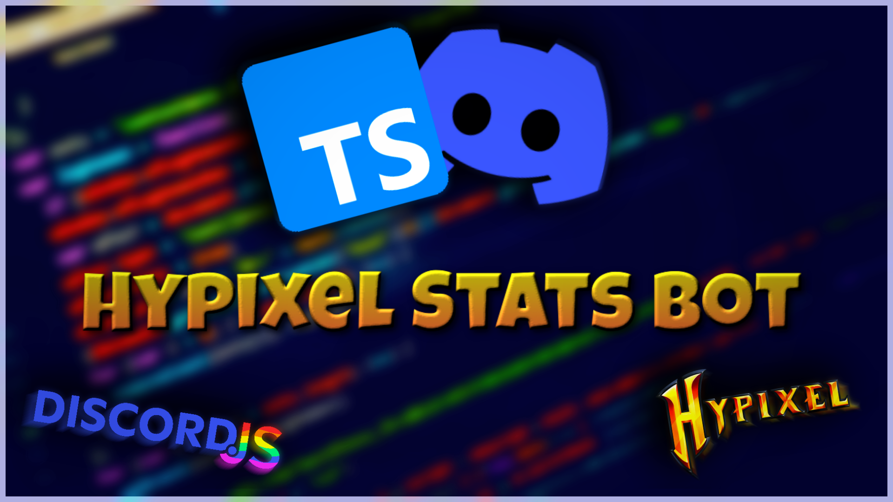

# Hypixel Stats Bot

  
    
    
     
     
    

 

  <h2>
    <strong>Simple Hypixel Stats Discord Bot in TypeScript</strong>
  </h2>

 

  

 

  <h2>Running a bot:</h3>
   
  <h3>1. Download or fork the repo</h3>
  <h3>2. In /hypixel-stats-bot install all packages with command</h3>

`npm install` or `yarn add`

  <h3>3. Add your bot token to slappey.json</h3>
  <h3>4. Add your hypixel api key to config.json</h3>
  <h3>5. Run the bot with command</h3>

`npm run dev` or `yarn dev`

   
   

  <h2>How to get hypixel api key?</h2>
   
  <h3>Join hypixel with your minecraft account and use command /api in the chat</h3>

   
   

  <h2>License</h2>
  <a href="./LICENSE">MIT</a>

   
   
   
   

  <h3>Videos</h3>
  - <a href="https://www.youtube.com/watch?v=Q1RYidqNIac">SpeedCoding a SkyWars command</a>
   
  - <a href="https://www.youtube.com/watch?v=WyDWSqa6FyU">SpeedCoding a User command</a>

